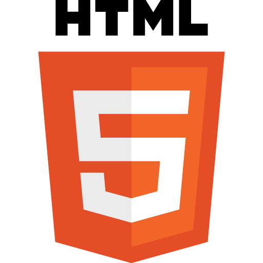

#HTML5 Boot Camp

##The future of Web Apps is here!
###Are you ready for it?
  
  

Index

1. [Objective](#bookmark=id.897be14cb359)

2. [Who Should Attend](#bookmark=id.21dc7aafc174)

3. [Duration](#bookmark=id.a73ab2f2ac11)

4. [Technical Assistance](#bookmark=id.dd060dbb7eb5)

5. [Performance Measurement](#bookmark=id.b5cf29d0ffa0)

6. [Handling advanced Developers](#bookmark=id.0cc111c885a5)

7. [Materials](#bookmark=id.f94cb75789dc)

8. [General Guidelines](#bookmark=id.997a3aca11cc)

9. [Proposed Test Applications](#bookmark=id.8b92757fa279)

10. [Environment Setup]

11. [Learning Days](#bookmark=id.b50bdb532fdc)

    * [Topic 1: Javascript Intro and jQuery](#bookmark=id.8dc70ccbbe50)

    * [Topic 2: jQuery Mobile](#bookmark=id.2a30572bd13a)

    * [Topic 3: OOP and Inheritance in Javascript](#bookmark=id.1351de2332d5)

    * [Topic 4: AMD + RequireJS](#bookmark=id.857777062f13)

    * [Topic 5: Template Engines](#bookmark=id.0f8ff196f7f0)

    * [Topic 6: MVC + Backbone](#bookmark=id.1bf98acf8811)

    * [Topic 7: HTML5 Tags and CSS3](#bookmark=id.1a41cc68fed7)

    * [Topic 8: HTML5 APIs](#bookmark=id.b350a3595b11)

    * [Topic 9: Modernizr + yepNope](#bookmark=id.b4608850fbe7)

12. [Your First Project Starts Now!](#bookmark=id.605681dc8138)

###Objective

This course teaches the basics of modern Web UI development which enables the creation of best of breed user experiences, gaming, and mobile applications.

→ [index](#bookmark=id.48b72f1065a3)

###Who Should Attend

The training will start at a low level and does not require in depth knowledge of the platform in question. Desirable participant profile: trainees and outside Globant candidates. A basic knowledge on HTML, CSS, and JavaScript is desired, though.

→ [index](#bookmark=id.48b72f1065a3)

###Duration

Five weeks total.

Three weeks for guided learning and two weeks for app development. 

→ [index](#bookmark=id.48b72f1065a3)

###Technical Assistance

You can contact other bootcamp participants or any available tutor if you need technical assistance. We will create one chat for boot camp members only, and another one for boot camp members and tutors when boot camp starts.

###Performance Measurement

1. Code review after each practice and sprint

2. Checkpoint completion after Learning stage with your assigned tutor

→ [index](#bookmark=id.48b72f1065a3)

###Handling Advanced Developers

Developers that move faster than average can go ahead and complete as much exercises as wanted. 

→ [index](#bookmark=id.48b72f1065a3)

###Materials

1. At least, three different browsers installed on the developer machine. Example, Chrome, Firefox, and the Android browser using Android's emulator.

2. The IDE to use is [SublimeText](http://www.sublimetext.com/).

3. Skype Account + headset (audio calls)

4. Create your own[ GitHub](https://github.com/) account. Follow this[ guideline](https://help.github.com/articles/set-up-git) to setup your account. 

5. Install your own LAMP server. Download[ WAMP](http://www.wampserver.com/en/) if you are using Windows, or[ XAMPP](http://www.apachefriends.org/en/xampp.html) in case you prefer Linux.

6. Create a new repository in[ GitHub](https://github.com/)  to host the project code.

→ [index](#bookmark=id.48b72f1065a3)

 

###General Guidelines

The boot camp is organized in the following way:

1. The first three weeks will be used for intensive self learning. Each topic will have reading and practices parts. Tutors will be available to answer technical questions on a given chat room. 

2. The next two weeks will be used to develop an application following a life process.

3. The project manager will coordinate learning days encouraging team communication in daily meetings.

4. The project manager will gather information regarding individual progress so we can look for alternative assistance where needed.

5. The project manager will lead the boot camp sprints as if it were a real project using SCRUM agile methodology.

6. Two boot camp chats will be created for feedback and technical assistance:

    1. Bootcamp HTML - ALL
Every person participating in the bootcamp is present here (students, tutors and PMs). Here is the place to ask for technical assistance!

    2. Bootcamp HTML - Assistants
Here you will reach just your boot camp fellows for asking question sharing knowledge.

7. Team play is encouraged but the work will be evaluated per person.

8. Sprint duration will be 1 week.

9. The instructions will be vague as they generally are in real life projects. You must look for support and guidance from your PM, teammates and tutors.

10. All code and documentation must be in English.

11. Code must adhere to Globant’s UI [HTML](https://github.com/globant-ui/html-style-guide), [CSS](https://github.com/globant-ui/css-style-guide) and [JavaScript](https://github.com/globant-ui/javascript-style-guide) coding guidelines.

→ [index](#bookmark=id.48b72f1065a3)

###Proposed Test Applications

The test application will consist in a Last.fm client.

###Learning Days###

Each day you will grab the fundamentals of the key building blocks for the next generation mobile apps; yeah, web apps! Web apps powered by the latest, and coolest toolkits, and techniques.

On each learning day you will have to:

1. ####Read:####
We will provide you with documentation related with current sprint content so you can have a background reference, guide and examples to complete the following practice.

2. ####Practice:####
You will implement the previously gathered knowledge in simple coding activities.
Most important task numbers are listed in the "*Key Points*" section for each day and they should get most of your attention; if you feel you don’t have enough time to complete all tasks, start with these ones when possible.

3. ####Commit:####
You will commit all your code on a daily basis, when you finish your practice.

####Topic 0: HTML & CSS Basics####

Before starting the boot camp, please revisit your knowledge on the following concepts:

* Recommended read: [http://learn.shayhowe.com/html-css/](http://learn.shayhowe.com/html-css/)

* HTML documents: [http://www.w3.org/community/webed/wiki/The_basics_of_HTML](http://www.w3.org/community/webed/wiki/The_basics_of_HTML)

* CSS basics: [http://www.w3.org/community/webed/wiki/CSS/Training](http://www.w3.org/community/webed/wiki/CSS/Training)

* CSS basic layouts: [http://learnlayout.com/](http://learnlayout.com/)

#####Optional:#####

* Accessibility basics: [http://www.w3.org/community/webed/wiki/Accessibility_basics](http://www.w3.org/community/webed/wiki/Accessibility_basics)

#####Practice (only HTML + CSS are required to finish the following exercises)#####:

1. Create a basic HTML5 index.html file

2. Add a header "Argentine Football Association", with a subheader containing your name.

3. Add a link to your email next to the subheader. If the user clicks on it, then an email client must open.

4. Add a navigation bar on the left side of the page with links to Argentine Primera División soccer teams. Is **highly recommended** to include a link to CAI. 

5. On the right side of the page add a table with the number of *Champions of America Cup *each team has won.

6. Add a footer with copyright information.

####Topic 1: Javascript Intro and jQuery (1 day)####

#####Reading:#####

1. Beginners: Eloquent Javascript [basic tutorial](http://eloquentjavascript.net/) (in case you need it!)

2. Beginners: Have fun with [Codecademy](http://www.codecademy.com/courses/jquery-and-the-dom) (more experienced devs might find it fun!).

3. Recommended: [jQuery Fundamentals](http://jqfundamentals.com/book/index.html) 

4. Explore [jQuery documentation](http://docs.jquery.com/Main_Page)

5. Javascript Prototypes: [http://www.slideshare.net/Dmitry.Baranovskiy/demystifying-prototypes-6183470](http://www.slideshare.net/Dmitry.Baranovskiy/demystifying-prototypes-6183470)

#####Extra documentation:#####

* Web Platform Documentation Project: [http://www.webplatform.org/](http://www.webplatform.org/)

* MDN Javascript Reference: [https://developer.mozilla.org/en/JavaScript/Reference](https://developer.mozilla.org/en/JavaScript/Reference)

* Annotated ECMAScript 5.1: [http://es5.github.com/](http://es5.github.com/)

#####Practice:#####

1. Create a basic index.html file. Use correct doctype, and tags. Add jQuery's latest version.

2. Add a stylesheet to the index.html. Use the stylesheet to center the text to all <section> elements of the page.

3. Add a hidden <section> with the following text inside: "Hello world". 

4. Add a button below the <section> to your index.html.

5. When the page has finished loading the section must fade in.

6. Add a textbox with the class "alias", and put the cursor inside it right after the <section> fades in.

7. Attach an event to the created button which calls a function that gets a response from [http://bootcamp.aws.af.cm/welcome/tunombre](http://bootcamp.aws.af.cm/welcome/tunombre)

8. Write the response to the <section> element.

9. Show <section> content in red when a server error occurs.

10. Take some free air and then create a function to highlight your name in the server response content. Call it right after setting the response inside the div.

11. AJAX: get the response from [http://tweetproxy.ap01.aws.af.cm/search](http://tweetproxy.ap01.aws.af.cm/search) with parameter data "q=html5"
First log the service response in Chrome's console to analyze data, then display tweets inside another section in the right side of the screen. The <article> element must be used to contain the Tweets.
For each tweet show: from_user, text, created_at, profile_image_url.

12. Add a transparent background covering the whole screen behind the tweets <section> so the background gets dimmed.

13. Validate your page using W3C validator: [https://addons.mozilla.org/en-US/firefox/addon/web-developer/](https://addons.mozilla.org/en-US/firefox/addon/web-developer/)

#####Key Points:#####

1, 5, 7, 10, 13

#####Mobile Test:#####

Test your code in a mobile device or in Android emulator.

#####Commit:#####

Commit your practice code.

→ [index](#bookmark=id.48b72f1065a3)

####Topic 2: Grid Systems, and CSS frameworks (1 day)####

#####Reading:#####

Review the documentation of the following CSS frameworks:

* Bootstrap: [http://getbootstrap.com/](http://getbootstrap.com/)

* Foundation: [http://foundation.zurb.com/](http://foundation.zurb.com/)

* Pure: [http://purecss.io/](http://purecss.io/)

More frameworks, and comparison:

* [http://usablica.github.io/front-end-frameworks/compare.html](http://usablica.github.io/front-end-frameworks/compare.html)

Optional reading:

* Dive into Responsive Prototyping with Foundation: [http://alistapart.com/article/dive-into-responsive-prototyping-with-foundation](http://alistapart.com/article/dive-into-responsive-prototyping-with-foundation)

* Building Twitter Bootstrap: [http://alistapart.com/article/building-twitter-bootstrap](http://alistapart.com/article/building-twitter-bootstrap)

#####Practice:#####

1. Build a Youtube video mosaic using Bootstrap, Foundation, and Pure based on the following wire-frame: [https://raw.github.com/globant-ui/html5bootcamp/master/assets/youtube_mosaic_home.png](https://raw.github.com/globant-ui/html5bootcamp/master/assets/youtube_mosaic_home.png). 

2. Build the home page of a sports newspaper using Bootstrap, Foundation, and Pure based on the following wire-frame: [https://raw.github.com/globant-ui/html5bootcamp/master/assets/sports_newspaper.png](https://raw.github.com/globant-ui/html5bootcamp/master/assets/sports_newspaper.png).

3. Validate your HTML/CSS using [https://addons.mozilla.org/en-US/firefox/addon/web-developer/](https://addons.mozilla.org/en-US/firefox/addon/web-developer/)

#####Key Points:#####

1, 2

#####Mobile Test:#####

Test your code in a mobile device or in Android emulator.

#####Commit:#####

Commit your practice code.

→ [index](#bookmark=id.48b72f1065a3)

####Topic 3: Design Patterns and OOP in Javascript (3 days)####

#####Reading:#####

1. Understand Javascript Prototypes: [http://javascriptweblog.wordpress.com/2010/06/07/understanding-javascript-prototypes/](http://javascriptweblog.wordpress.com/2010/06/07/understanding-javascript-prototypes/)

2. Understand Javascript OO: [http://killdream.github.com/blog/2011/10/understanding-javascript-oop/index.html](http://killdream.github.com/blog/2011/10/understanding-javascript-oop/index.html)

3. Read [this](http://addyosmani.com/resources/essentialjsdesignpatterns/book/) article about Javascript design patterns by Addy Osmani

#####Extra documentation:#####

* [Javascript Patterns Collection](http://shichuan.github.com/javascript-patterns/)

* [A fresh look at JavaScript Mixins](http://www.google.com/url?q=http%3A%2F%2Fjavascriptweblog.wordpress.com%2F2011%2F05%2F31%2Fa-fresh-look-at-javascript-mixins%2F&sa=D&sntz=1&usg=AFQjCNG2JuQos_dZy63pUOC7fCIwhtirZA)

#####Practice:#####

1. Create a Movie object:

<table>
  <tr>
    <td>Movie</td>
  </tr>
  <tr>
    <td>-attributes : hashmap</td>
  </tr>
  <tr>
    <td>+ play()  + stop() + set(attr:string, value) + get(attr:string)</td>
  </tr>
</table>

2. Instantiate some of your favourite movies and play with them in the console.

3. Add a MovieObserver class that listens for "*playing*" and “*stopped*” events.

4. Publish "*playing*" event on Movie.play().
You should be able to do something like this in the console:
var terminator = new Movie();
terminator.set('title', 'Terminator');
...
terminator.play(); //output: Playing Terminator...

5. Publish "*stopped*" event on Movie.stop().

6. Log to console when each event is fired.

7. Refactor Movie class as a Module keeping your previous code for reference.

8. Create a DownloadableMovie that extends from Movie adding a download` `method.

9. Create a  mixin object called Social with the methods: share(friendName) and like().

10. Apply the mixin to Movie object and play with the console output.
You should be able to do something like this in the console:
	var ironman2 = new Movie();
	ironman2.set('title', 'Iron Man 2');
	...
	ironman2.share(‘V. Rivas’); //output: Sharing Iron Man 2 with V. Rivas

11. Create an Actor class and create some actors from one of your favorite movies.

12. Show how you would add an array of actors to a Movie object.

#####Key Points:#####

3, 4, 8, 10

#####Commit:#####

Commit your practice code.

→ [index](#bookmark=id.48b72f1065a3)

####Topic 4: FrontEnd Development Best Practices (2 day)####

#####Reading on Testing#####

* Unit testing with Jasmine: [http://www.adobe.com/devnet/html5/articles/unit-test-javascript-applications-with-jasmine.html](http://www.adobe.com/devnet/html5/articles/unit-test-javascript-applications-with-jasmine.html)

* Getting started with Jasmine: [http://pivotal.github.io/jasmine/](http://pivotal.github.io/jasmine/)

#####Reading on Performance#####

* Learn the basics of FrontEnd performance: 

    1. [http://developer.yahoo.com/performance/](http://developer.yahoo.com/performance/)

    2. [https://developers.google.com/speed/docs/insights/rules](https://developers.google.com/speed/docs/insights/rules)

    3. [http://javascriptrocks.com/performance/](http://javascriptrocks.com/performance/)

#####Reading on Task Automation#####

* Grunt

    * [http://gruntjs.com/](http://gruntjs.com/)

    * [http://flippinawesome.org/2  013/07/01/building-a-javascript-library-with-grunt-js/](http://flippinawesome.org/2013/07/01/building-a-javascript-library-with-grunt-js/)

#####Practice:#####

1. Create tests for the files in the following repository: [https://github.com/globant-ui/html5bootcamp/tree/master/topic4](https://github.com/globant-ui/html5bootcamp/tree/master/topic4).

2. Measure performance of the web pages developed during topic 2.

3. Create a Grunt file to optimize the web pages developed during topic 2. Make sure you can optimize all JS, CSS, and images. Add tasks to lint CSS and JS files.

4. Create a Grunt file to run all tests developed in exercise 1.

5. Compare the performance of the optimized web pages against the result from exercise 2. Put the results in a README.md file. Explain the results.

→ [index](#bookmark=id.48b72f1065a3)

####Topic 5: AMD + RequireJS (1 day)####

#####Reading:#####

1. Read about [AMD paradigm](http://unscriptable.com/code/Using-AMD-loaders)

2. Read about [module pattern limitations](http://snook.ca/archives/javascript/no-love-for-module-pattern)

3. Read [RequireJS documentation](http://requirejs.org/) and samples

Extra documentation:

* [AMD: The Definitive Source](http://www.sitepen.com/blog/2012/06/25/amd-the-definitive-source/)

* [Writing Modular Javascript](http://addyosmani.com/blog/writing-modular-javascript/)

* [What are the use cases for RequireJS vs. Yepnope vs. LABjs?](http://www.quora.com/What-are-the-use-cases-for-RequireJS-vs-Yepnope-vs-LABjs) (Quora)

#####Practice:#####

1. Create a new index.html file as you did it the first day.

2. Add RequireJS .

3. Create the same Movie class as in the previous practice, but inside a module; the module will be an external file.

4. Create a Director class inside a module and set it as a dependency on the Movie module. 

5. Add name:string, a quotes:array properties, and a speak()methods to Director; calling speak() will return director’s quotes.

6. Add a Director to a Movie
You should be able to do something like this in the console:
    var alien = new Movie();
	...
	var ridleyScott = new Director(‘Ridley Scott’); //sets name in constructor
	ridleyScott.set('quotes', ['Cast is everything.', 'Do what ...']);
	alien.set('director', ridleyScott);
	alien.get('director').speak(); //output: Ridley Scott says: 'Cast is...'

7. Add jQuery as a module (hint: use the [shim](http://requirejs.org/docs/api.html#config-shim) support).

8. Using jQuery show Director quotes.

9. Configure a Grunt script that uses grunt-contrib-requirejs to create a bundled version of the project.

#####Key Points:#####

2, 3

#####Commit:#####

Commit your practice code.

→ [index](#bookmark=id.48b72f1065a3)

####Topic 6: Template Engines (1 day)####

#####Reading:#####

1. Know [Handlebars](http://handlebarsjs.com/).

2. Know [Underscore](http://documentcloud.github.com/underscore/) template parsing capabilities.

3. Know [{dust}](http://www.google.com/url?q=http%3A%2F%2Fakdubya.github.com%2Fdustjs%2F&sa=D&sntz=1&usg=AFQjCNHxT9p9k0f-C7NBell-5HYVPgpHaw).

#####Extra documentation:#####

* Client-side template engine comparison: [http://engineering.linkedin.com/frontend/client-side-templating-throwdown-mustache-handlebars-dustjs-and-more](http://engineering.linkedin.com/frontend/client-side-templating-throwdown-mustache-handlebars-dustjs-and-more)

#####Practice:#####

1. Create a new index.html file and link the three template engines. The three files must be linked from a libs directory.

2. Write a template for a professional profile (linkedIn alike but simpler).

3. Create a JSON file with your professional profile data.

4. When document finishes loading parse the template with your data.

5. If you didn’t add work experience to the JSON file do it now using an array.

6. Adjust your template and parse it using template engine facilities for iteration.

7. Repeat with the next template engine from the reading list.

#####Key Points:#####

4, 6

#####Mobile Test:#####

Test your code in a mobile device or in Android emulator.

If it does not look good fix it with minimal changes. 

#####Commit:#####

Commit your practice code.

→ [index](#bookmark=id.48b72f1065a3)

####Topic 7: MVC & Mixins (3 days)####

#####Reading:#####

1. Read about the [MVC design pattern](http://en.wikipedia.org/wiki/Model%E2%80%93view%E2%80%93controller)

2. [MVC Architecture for Javascript Applications](http://michaux.ca/articles/mvc-architecture-for-javascript-applications)

3. Learn the basics of [Backbone.js](http://documentcloud.github.com/backbone/); [https://github.com/addyosmani/backbone-fundamentals](https://github.com/addyosmani/backbone-fundamentals)

4. Learn the basics of AngularJs: [http://angularjs.org/](http://angularjs.org/)

5. Learn the basics of EmberJs: [http://emberjs.com/](http://emberjs.com/)  

#####Practice:#####

1. Using Backbone, create a movie listing with your favorite movies. Data shall be persisted in localhost.

2. Show movie details in a separate details view.

3. Allow to add / edit / remove movies from the list.

4. Implement the same application using Ember and Angular.

#####Key Points:#####

1, 4

#####Commit:#####

Commit your practice code.

→ [index](#bookmark=id.48b72f1065a3)

####Topic 8: HTML5 Tags and CSS3(1 day)####

#####Reading:#####

1. Read about [new HTML tags](http://diveintohtml5.info/semantics.html).

2. Make sure you understand the [CSS's Box Model](http://learn.shayhowe.com/html-css/box-model)

    1. [http://reference.sitepoint.com/css/boxmodel](http://reference.sitepoint.com/css/boxmodel) (optional)

    2. [https://developer.mozilla.org/en-US/docs/CSS/box_model](https://developer.mozilla.org/en-US/docs/CSS/box_model) (optional)

3. Responsive Web Design

    3. Read this [great article about responsive design](http://www.alistapart.com/articles/responsive-web-design/).

    4. Read about *Layout Patterns*: [http://www.lukew.com/ff/entry.asp?1514](http://www.lukew.com/ff/entry.asp?1514)

    5. Look at this collection of layout patterns: [http://www.maxdesign.com.au/articles/css-layouts/](http://www.maxdesign.com.au/articles/css-layouts/)

4. Check out examples of responsive web design: [http://mediaqueri.es/](http://mediaqueri.es/)

5. If you feel strong about CSS, then go pro: [http://learn.shayhowe.com/advanced-html-css/](http://learn.shayhowe.com/advanced-html-css/)

#####Suggested readings:#####
[CSS Specificity: Things You Should Know](http://www.google.com/url?q=http%3A%2F%2Fcoding.smashingmagazine.com%2F2007%2F07%2F27%2Fcss-specificity-things-you-should-know%2F&sa=D&sntz=1&usg=AFQjCNG3MN8l-eWjjx4yhsrtp8Y0TkAVSg)

#####Practice:#####

1. Create a basic page using the new HTML5 tags. That page must follow a fixed-desktop-layout.

2. From the *layout patterns* article, implement the following patterns:

    1. Mostly Fluid

    2. Column Drop

    3. Layout Shifter

    4. Off Canvas

#####Key Points:#####

1, 2

#####Commit:#####

Commit your practice code.

→ [index](#bookmark=id.48b72f1065a3)

####Topic 9: HTML5 APIs (1 day)####

#####Reading:#####

1. Take a glimpse into HTML5 APIs: [http://www.html5rocks.com/en/](http://www.html5rocks.com/en/)

    1. Storage APIs: [http://www.html5rocks.com/en/features/storage](http://www.html5rocks.com/en/features/storage)

    2. Graphic APIs: [http://www.html5rocks.com/en/features/graphics](http://www.html5rocks.com/en/features/graphics)

    3. Connectivity APIs: [http://www.html5rocks.com/en/features/connectivity](http://www.html5rocks.com/en/features/connectivity)

    4. Drag & Drop API: [http://html5doctor.com/native-drag-and-drop/](http://html5doctor.com/native-drag-and-drop/)

    5. File APIs: [http://www.html5rocks.com/en/features/file_access](http://www.html5rocks.com/en/features/file_access)

2. Now, take a deep dive into HTML5: [http://diveintohtml5.info/](http://diveintohtml5.info/) (optional)

3. Use [http://playground.html5rocks.com/](http://playground.html5rocks.com/) to play a little bit with them.

#####Practice:#####

1. Create a page with a textarea and a save button. Save textarea content's when the user clicks on save. Use both localStorage and IndexedDB. 

2. Add a clear button to erase saved content.

3. Add drag and drop support to load text files.

4. Open a web socket and test it against [this echo service](http://websocket.org/echo.html).

5. Create a web page with a canvas element. Upon page load draw basic geometric figures with random colors and strokes.

6. Using the Canvas API animate a rectangle's position on the screen. Make sure not to use setTimeout but requestTimeFrame to perform the animation.

7. Create a web page with a SVG element to show a vector graphic. Make sure you understand when is better to use SVG instead of bitmaps, and viceversa.

#####Key Points:#####

1, 3, 6

#####Commit:#####

Commit your practice code.

→ [index](#bookmark=id.48b72f1065a3)

###Your First Project Starts Now!###

####It’s time for the real thing.####

You will work on a project to achieve a fully working multi platform mobile app developed in Javascript and using the latest tags and APIs available in HTML5.

You will apply all the knowledge obtained during the learning weeks.

You’ll be given with a backlog of user stories you will estimate with your PM.

Once estimated, user stories will be divided into sprints of one week.

You will participate on daily scrum meetings.
Will you be able to consult documentation? Of course! You will be able to use any resource you know that helps you complete your user stories, be it going back to documentation sites, tutorials or just googling what you need. Luckily the web is plenty of awesome resources waiting for you to grasp them!

####Commits####

You will commit your code to GitHub on a daily basis.

####Reviews####

Tutors will give you feedback at the end of each sprint by reviewing and commenting your committed code in GitHub. If possible tutors will give you even more frequent feedback, sometimes at the end of the day.

→ [index](#bookmark=id.48b72f1065a3)

Thanks for reading!

